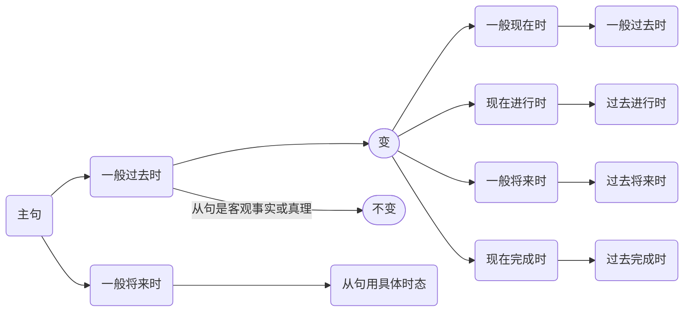

# 宾语从句
## 结构
主语 + 谓语/$be_v$+adj. + 引导词 + 从句
## 引导词
1. that (可省略) //陈述句
2. if/whether //一般疑问句
3. 特殊疑问词 //特殊疑问句
:::tip[whether与if的区别:]
- whether or not
- whether to do
- 介词后，用**whether** 例: Joe is worried about __whether__ she will come.
- 置于句首时，用**whether** 例: Whether you are wrong or not is not important.
- 宾语从句是否定时，用**if** 例: She doesn't mind if you can't pass the exam. 她并不关心这次考试你是否不及格
:::
## 常见谓语动词
- that:
	- find,know,think,believe,hope,notice,mean
- if/whether/特殊疑问词:
	- ask,see,wonder,find out
:::tip[doubt]
- 肯定句中，可以接 whether/if 从句 例：I doubt whether he will come
- 否定句中，**必须**使用 that 从句 例：I don't doubt that he will succeed 
:::
## 陈述语序
## 时态一致
